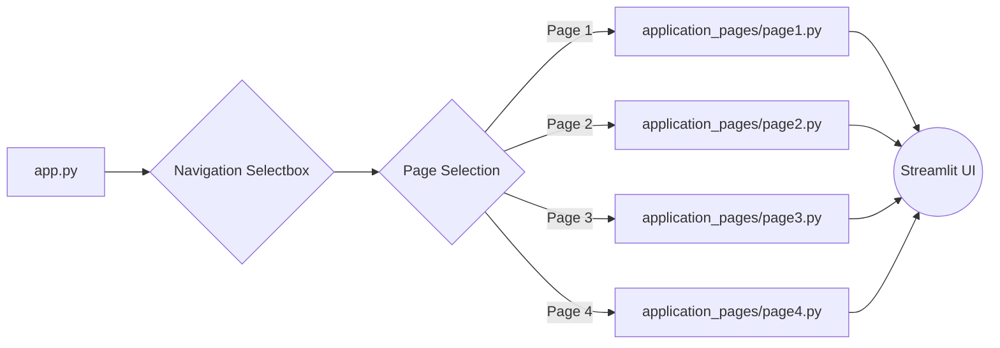

id: 67f9368ad05265d2d8e155e2_documentation
summary: Portfolio Optimization Examples Using Financial Toolbox Documentation
feedback link: https://docs.google.com/forms/d/e/1FAIpQLSfWkOK-in_bMMoHSZfcIvAeO58PAH9wrDqcxnJABHaxiDqhSA/viewform?usp=sf_link
environments: Web
status: Published
# QuLab: A Comprehensive Guide to Understanding and Utilizing the Streamlit Application

This codelab provides a comprehensive walkthrough of the QuLab Streamlit application. QuLab serves as a demonstration platform built using Streamlit, designed for educational purposes and illustrating various application functionalities. By the end of this codelab, you will understand the application's structure, navigation, and individual page implementations. You will also be able to extend the application with new features and pages.

## Setting Up Your Development Environment
Duration: 00:05

Before diving into the code, ensure you have the following:

1.  **Python:**  Python 3.7 or higher is required.

2.  **Streamlit:** Install Streamlit using pip:
    ```bash
    pip install streamlit
    ```

3.  **Project Structure:** Create the following project structure:
    ```
    quLab/
    ├── app.py
    └── application_pages/
        ├── page1.py
        ├── page2.py
        └── page3.py
    ```
    Place the provided code snippets into their corresponding files.

## Understanding the Core Application (app.py)
Duration: 00:10

The `app.py` file is the heart of the QuLab application. Let's break down its key components:

```python
import streamlit as st

st.set_page_config(page_title="QuLab", layout="wide")
st.sidebar.image("https://www.quantuniversity.com/assets/img/logo5.jpg")
st.sidebar.divider()
st.title("QuLab")
st.divider()

# Your code goes here
page = st.sidebar.selectbox(label="Navigation", options=["Page 1", "Page 2", "Page 3"])

if page == "Page 1":
    try:
        from application_pages.page1 import run_page1
        run_page1()
    except Exception as e:
        st.error(f"An error occurred while loading Page 1: {e}")
elif page == "Page 2":
    try:
        from application_pages.page2 import run_page2
        run_page2()
    except Exception as e:
        st.error(f"An error occurred while loading Page 2: {e}")
elif page == "Page 3":
    try:
        from application_pages.page3 import run_page3
        run_page3()
    except Exception as e:
        st.error(f"An error occurred while loading Page 3: {e}")
# Your code ends

st.divider()
st.write("© 2025 QuantUniversity. All Rights Reserved.")
st.caption("The purpose of this demonstration is solely for educational use and illustration. "
           "Any reproduction of this demonstration "
           "requires prior written consent from QuantUniversity.")
```

1.  **Imports:** `import streamlit as st` imports the Streamlit library, which is essential for building the application.
2.  **Page Configuration:** `st.set_page_config(page_title="QuLab", layout="wide")` sets the page title and layout.  `layout="wide"` configures the app to use the full screen width.
3.  **Sidebar Elements:**
    *   `st.sidebar.image(...)` displays the QuantUniversity logo in the sidebar.
    *   `st.sidebar.divider()` adds a horizontal line to visually separate the logo.
4.  **Main Title:** `st.title("QuLab")` displays the main title of the application.
5.  **Navigation:**
    *   `page = st.sidebar.selectbox(label="Navigation", options=["Page 1", "Page 2", "Page 3"])` creates a selectbox in the sidebar allowing the user to choose between different pages.
6.  **Page Loading Logic:** The `if/elif/else` block dynamically imports and runs the selected page's code.  This modular approach helps to organize the application and keeps the main `app.py` file clean.  Error handling (`try...except`) is included to gracefully handle potential import or runtime errors in individual pages.
7.  **Footer:** Adds a divider, copyright notice, and a caption emphasizing the educational purpose of the demonstration.

## Understanding Individual Pages (application_pages/page*.py)
Duration: 00:05

Each file in the `application_pages` directory represents a separate page in the application. Let's look at `page1.py` as an example:

```python
import streamlit as st

def run_page1():
    st.title("Page 1")
    st.write("Content for Page 1")
```

Each page module defines a `run_pageX()` function. This function is responsible for rendering the content of that specific page. In this example, it simply displays a title and some text.

## Running the Application
Duration: 00:02

To run the application, navigate to the root directory (where `app.py` is located) in your terminal and execute the following command:

```bash
streamlit run app.py
```

This will start the Streamlit server and open the application in your web browser.

## Modifying Existing Pages
Duration: 00:10

Let's modify `application_pages/page1.py` to add a simple interactive element. Replace the contents of the file with the following:

```python
import streamlit as st

def run_page1():
    st.title("Page 1")
    st.write("Welcome to Page 1! Let's try a simple slider.")

    slider_value = st.slider("Select a number", 0, 100, 50)  # min, max, default
    st.write(f"You selected: {slider_value}")
```

Save the file and refresh your browser. You should now see a slider on Page 1, and the selected value will be displayed below the slider.

## Adding a New Page
Duration: 00:15

Let's add a new page to the application.

1.  **Create a new file:** Create a file named `application_pages/page4.py` with the following content:

    ```python
    import streamlit as st

    def run_page4():
        st.title("Page 4")
        st.write("This is the content for the newly added Page 4.")
        st.balloons()
    ```

2.  **Modify `app.py`:**  Update the `app.py` file to include the new page in the navigation.

    ```python
    import streamlit as st

    st.set_page_config(page_title="QuLab", layout="wide")
    st.sidebar.image("https://www.quantuniversity.com/assets/img/logo5.jpg")
    st.sidebar.divider()
    st.title("QuLab")
    st.divider()

    # Your code goes here
    page = st.sidebar.selectbox(label="Navigation", options=["Page 1", "Page 2", "Page 3", "Page 4"]) #Modified line

    if page == "Page 1":
        try:
            from application_pages.page1 import run_page1
            run_page1()
        except Exception as e:
            st.error(f"An error occurred while loading Page 1: {e}")
    elif page == "Page 2":
        try:
            from application_pages.page2 import run_page2
            run_page2()
        except Exception as e:
            st.error(f"An error occurred while loading Page 2: {e}")
    elif page == "Page 3":
        try:
            from application_pages.page3 import run_page3
            run_page3()
        except Exception as e:
            st.error(f"An error occurred while loading Page 3: {e}")
    elif page == "Page 4":  # New block added
        try:
            from application_pages.page4 import run_page4
            run_page4()
        except Exception as e:
            st.error(f"An error occurred while loading Page 4: {e}")
    # Your code ends

    st.divider()
    st.write("© 2025 QuantUniversity. All Rights Reserved.")
    st.caption("The purpose of this demonstration is solely for educational use and illustration. "
               "Any reproduction of this demonstration "
               "requires prior written consent from QuantUniversity.")
    ```

Refresh your browser. You should now see "Page 4" as an option in the navigation selectbox. Selecting it will display the content of `page4.py` including the balloons!

<aside class="positive">
<b>Best Practice:</b> Always use try-except blocks when importing and running page-specific code. This will prevent the entire application from crashing if there's an error in one of the pages.
</aside>

## Key Concepts Explained
Duration: 00:08

*   **Modularity:** The application uses a modular design, where each page is implemented in a separate file. This makes the code easier to manage and maintain.
*   **Dynamic Page Loading:** The `app.py` file dynamically loads the selected page's code using `import` statements. This allows for a flexible and efficient application structure.
*   **Streamlit Widgets:** Streamlit provides a variety of widgets (e.g., `st.slider`, `st.selectbox`) that allow you to create interactive elements in your application.
*   **Error Handling:** The `try...except` blocks ensure that the application can gracefully handle errors that may occur in individual pages.

## Architecture Diagram
Duration: 00:05

Here's a simplified architecture diagram of the QuLab application:



This diagram illustrates how the `app.py` file controls the navigation and loads the appropriate page content, which is then rendered by Streamlit in the user interface.

## Conclusion
Duration: 00:02

You have now completed the QuLab codelab. You should have a good understanding of the application's structure, navigation, and individual page implementations. You are now equipped to modify existing pages, add new pages, and extend the application with more advanced features. Remember that this application is designed for educational purposes. Happy coding!
